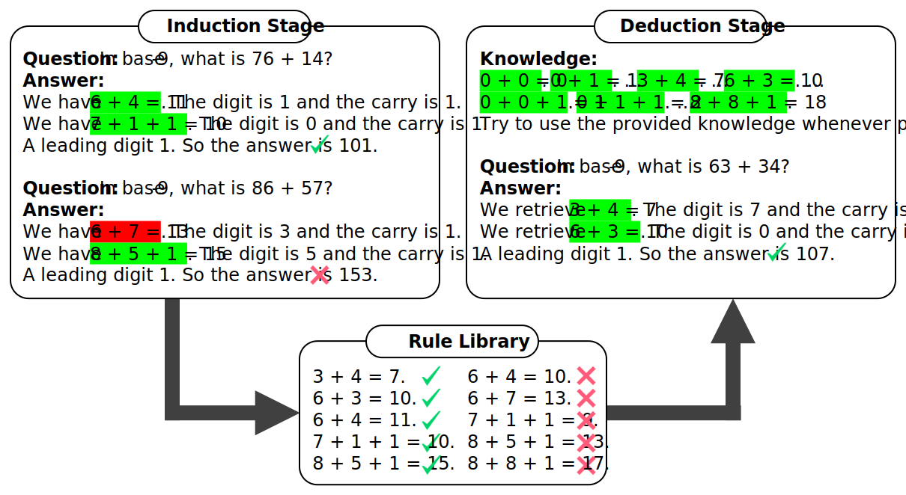

# llms_can_learn_rules



A major reason for failure of chain-of-thought prompting is its tendency to
hallucinate rules in multi-step reasoning. Our work, Hypotheses-to-Theories (HtT),
prompts LLMs to induce rules from training samples, build a rule library, and
apply it to solve reasoning problems.

HtT can be viewed as a new paradigm of learning with LLMs. Instead of learning
model parameters, HtT learns a rule library that transfers across different models
and textual forms. It can be applied to black-box LLMs such as GPT-4 and Gemini-Pro.

## Installation

First, let's create a virtual environment:

Below we will use conda environment. If you haven't heard about conda, you can install the miniconda following https://docs.conda.io/projects/miniconda/en/latest/

```bash
conda create -n htt python=3.10
conda activate htt
```

Install dependencies through pip.

```bash
pip install -r requirements.txt
```

If it is your first time using nltk, please also download the necessary pieces:

```python
>>> import nltk
>>> nltk.download('punkt')
>>> nltk.download('punkt_tab')
```


Export your API keys as an environment variable.

```bash
export OPENAI_API_KEY=your-open-ai-key
export GOOGLE_API_KEY=your-google-key
```

## 🛠️ Usage ##

### Dataset ###

Please navigate to `artifacts/dataset` and run the `download.sh` script to prepare the datasets.

Use `source/train.py` for training HtT and `source/test.py` for testing HtT and
other methods. All the experiments will be logged in `experiment/`.

### Training (Induction Stage) ###

Below are the command lines for training HtT. Note if you train HtT with GPT-4,
it will incur substantial time (2-21 hours) and cost ($20-270 USD) per dataset.
If you only want to reproduce the results of HtT, we highly recommend you to use
the provided checkpoints of rule libraries.

```bash
python source/train.py -c artifacts/config/clutrr/symbolic/gpt-4_5-shot_cot_htt.yaml --num-iteration 2000
python source/train.py -c artifacts/config/arithmetic/base-16/gpt-4_5-shot_cot_htt.yaml --num-iteration 2000
python source/train.py -c artifacts/config/arithmetic/base-11/gpt-4_5-shot_cot_htt.yaml --num-iteration 2000
python source/train.py -c artifacts/config/arithmetic/base-9/gpt-4_5-shot_cot_htt.yaml --num-iteration 2000
python source/train.py -c artifacts/config/list_functions/gpt-4_4-shot_cot_htt.yaml --num-iteration 5000
```

### Test (Deduction Stage) ###

Here are the command lines for testing HtT based on the provided rule libraries.
If you want to test with your own rule libraries, modify the library path in the
corresponding config files.

```bash
python source/test.py -c artifacts/config/clutrr/symbolic/gpt-4_5-shot_cot_htt.yaml
python source/test.py -c artifacts/config/clutrr/textual/gpt-4_5-shot_cot_htt.yaml
python source/test.py -c artifacts/config/arithmetic/base-16/gpt-4_5-shot_cot_htt.yaml
python source/test.py -c artifacts/config/arithmetic/base-11/gpt-4_5-shot_cot_htt.yaml
python source/test.py -c artifacts/config/arithmetic/base-9/gpt-4_5-shot_cot_htt.yaml
python source/test.py -c artifacts/config/list_functions/gpt-4_4-shot_cot_htt.yaml
```

To run baseline methods like 0-shot CoT and 5-shot Cot, use the following commands

```bash
python source/test.py -c artifacts/config/clutrr/symbolic/gpt-4_0-shot_cot_htt.yaml
python source/test.py -c artifacts/config/clutrr/textual/gpt-4_0-shot_cot_htt.yaml
python source/test.py -c artifacts/config/arithmetic/base-16/gpt-4_0-shot_cot.yaml
python source/test.py -c artifacts/config/arithmetic/base-11/gpt-4_0-shot_cot.yaml
python source/test.py -c artifacts/config/arithmetic/base-9/gpt-4_0-shot_cot.yaml
python source/test.py -c artifacts/config/list_functions/gpt-4_0-shot_cot.yaml
```

```bash
python source/test.py -c artifacts/config/clutrr/symbolic/gpt-4_5-shot_cot_htt.yaml
python source/test.py -c artifacts/config/clutrr/textual/gpt-4_5-shot_cot_htt.yaml
python source/test.py -c artifacts/config/arithmetic/base-16/gpt-4_5-shot_cot.yaml
python source/test.py -c artifacts/config/arithmetic/base-11/gpt-4_5-shot_cot.yaml
python source/test.py -c artifacts/config/arithmetic/base-9/gpt-4_5-shot_cot.yaml
python source/test.py -c artifacts/config/list_functions/gpt-4_4-shot_cot.yaml
```

## 📂 Code Structure ##

- `artifacts/checkpoint/`: checkpoints of rule libraries
- `artifacts/config/`: configuration files for experiments
- `artifacts/dataset/`: benchmark datasets
- `artifacts/prompt/`: prompts written in [jinja](https://jinja.palletsprojects.com/)
- `source/`: source files written in python

## 🗡️ Reproducibility ##

Due to the randomness in LLMs, change in OpenAI models and reimplementation of
our codebase, this repo may not reproduce the exact numbers in the paper.

It is normal to observe numbers higher or lower than those the paper, but the
rankings of methods should be preserved on strong models like GPT-4:
few-shot CoT + HtT > few-shot CoT > 0-shot CoT.


## Citing this work

If you use HtT or this repo in your research, please cite the following paper.


```bibtex
@article{zhu2023large,
  title={Large Language Models can Learn Rules},
  author={Zhu, Zhaocheng and Xue, Yuan and Chen, Xinyun and Zhou, Denny and Tang, Jian and Schuurmans, Dale and Dai, Hanjun},
  journal={arXiv preprint arXiv:2310.07064},
  year={2023}
}
```

## License and disclaimer

Copyright 2023 DeepMind Technologies Limited

All software is licensed under the Apache License, Version 2.0 (Apache 2.0);
you may not use this file except in compliance with the Apache 2.0 license.
You may obtain a copy of the Apache 2.0 license at:
https://www.apache.org/licenses/LICENSE-2.0

All other materials are licensed under the Creative Commons Attribution 4.0
International License (CC-BY). You may obtain a copy of the CC-BY license at:
https://creativecommons.org/licenses/by/4.0/legalcode

Unless required by applicable law or agreed to in writing, all software and
materials distributed here under the Apache 2.0 or CC-BY licenses are
distributed on an "AS IS" BASIS, WITHOUT WARRANTIES OR CONDITIONS OF ANY KIND,
either express or implied. See the licenses for the specific language governing
permissions and limitations under those licenses.

This is not an official Google product.
